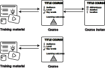

# What are the major bits and pieces OR How to mark up your content with Bioschemas?

[add-bioschemas file='docs/training-material.yaml']

{ align=right }

Most webmasters are familiar with HTML tags on their pages. Usually, HTML tags tell the browser how to display the information included in the tag. For example, `<h1>Avatar</h1>` tells the browser to display the text string "Avatar" in a heading 1 format. However, the HTML tag doesn't give any information about what that text string means—"Avatar" could refer to the hugely successful 3D movie, or it could refer to a type of profile picture—and this can make it more difficult for search engines to intelligently display relevant content to a user.

[Schema.org](https://schema.org/) provides a collection of shared vocabularies webmasters can use to mark up their pages in ways that can be understood by the major search engines: Google, Microsoft and alike.

You use the schema.org vocabulary along with the Microdata, RDFa, or JSON-LD formats to add information to your Web content. This guide will help get you up to speed with JSON-LD and Bioschemas so that you can start adding markup to your web pages.

Although this guide focuses on Bioschemas and JSON-LD objects. The basic ideas (types, properties etc.) introduced here are relevant beyond JSON-LD and apply for other markup with microdata or RDFa.

> TODO: Fill up image above (Original concept: flowchart of use cases - HTML -> Static site generators -> CMS like Wordpress)

# Bioschemas profiles for training resources

Many training related resources will include pages describing tutorials or courses. As such, they are marked up using the following three profiles:

- `TrainingMaterial`: A profile describing training materials in life sciences, it can be used on its own (as it happens with the Bioschemas tutorials) or in combination with a `CourseInstance`.
- `Course`: A profile describing a course from a generic point of view, i.e., the learning objectives of a course rather than where and when it is delivered.
- `CourseInstance`: A profile describing a particular instance of a course, i.e., an edition of a course that is scheduled for specific dates and happening in a specific location (that of course can be online or on-site, virtual or real).

Note that the `CourseInstance` profile is used in tandem with the `Course` profile, i.e., a `CourseInstance` does not exist without a `Course` but a `Course` can exist without a `CourseInstance` (there are no current offerings of the course).

P.S.:The properties in this profile schemas are not exausting and can be overlaping

# Sitemap

A sitemap is a file where you provide information about the pages, videos, and other files on your site, and the relationships between them. Search engines like Google read this file to crawl your site more efficiently. A sitemap tells search engines which pages and files you think are important in your site, and also provides valuable information about these files. For example, when the page was last updated and any alternate language versions of the page.

You can use a sitemap to provide information about specific types of content on your pages, including video, image, and news content. For example:

    A sitemap video entry can specify the video running time, rating, and age-appropriateness rating.
    A sitemap image entry can include the location of the images included in a page.
    A sitemap news entry can include the article title and publication date.

## Do I need a sitemap?

You might need a sitemap if:
-----------------------------

- **Your site is large:**

Generally, on large sites it's more difficult to make sure that every page is linked by at least one other page on the site. As a result, it's more likely Googlebot might not discover some of your new pages.

- **Your site is new and has few external links to it:**

Googlebot and other web crawlers crawl the web by following links from one page to another. As a result, Googlebot might not discover your pages if no other sites link to them.

- **Your site has a lot of rich media content (video, images) or is shown in Google News:**

Google can take additional information from sitemaps into account for Search.

You might not need a sitemap if:
-----------------------------

- **Your site is "small":**

By small, we mean about 500 pages or fewer on your site. Only pages that you think need to be in search results count toward this total.

- **Your site is comprehensively linked internally:**

This means that Googlebot can find all the important pages on your site by following links starting from the home page.

- **You don't have many media files (video, image) or news pages that you want to show in search results:**

Sitemaps can help Google find and understand video and image files, or news articles, on your site. If you don't need these results to appear in Search you might not need a sitemap.

You will see in the next chapter how the sitemap relates to Bioschemas and Schemas.org and how it will influence the scrapping of your website. Last you will find a chapter dedicted to sitemaps and how to create one for your website.

cite: schema.org
